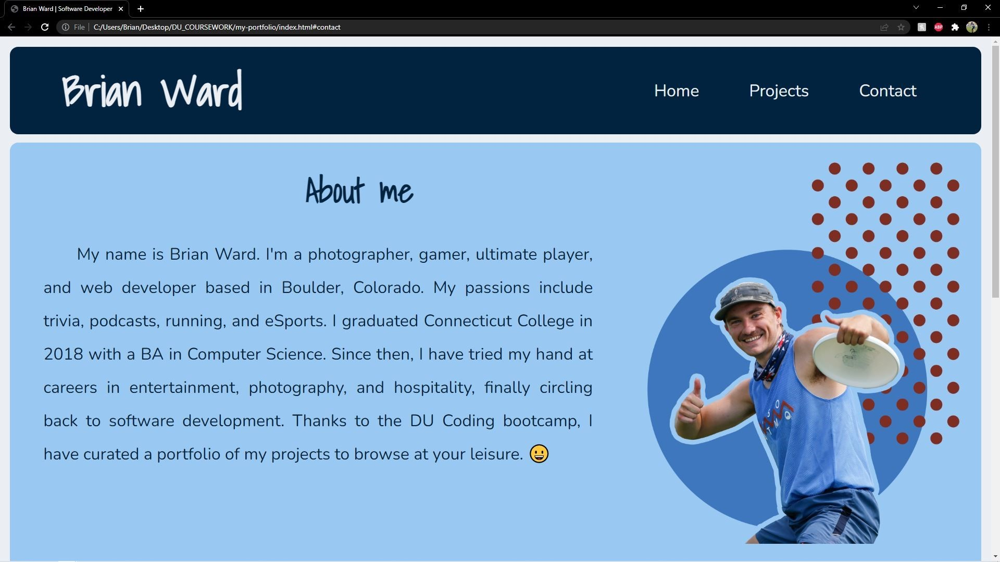
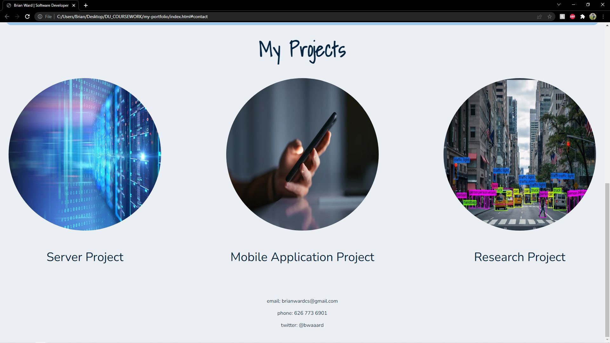

# Homework 02: My portfolio

## Contents
My portfolio contains a header with a title and a navigational bar. Below that, there is an "About me" section which contains a short bio and an avatar. The section below that contains links to future projects of mine, currently represented as stylized images. Finally the footer contains my contact information.

## Functionality
Navigational bar links jump to corresponding spot on the page. Adjusts wrap as viewport window gets narrower. About me section contains two divs, one for text and one for the image. Both divs are centered using flex and both wrap according to viewport width. Icons for project links glow and enlarge when hovered; cursor changes to pointer to indicate a link.

## Screenshots

